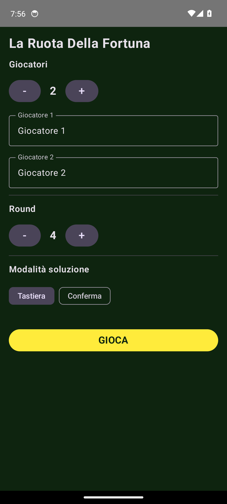
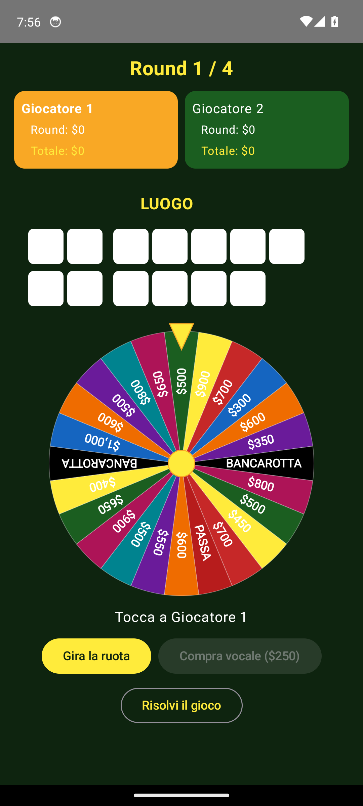

# La Ruota Della Fortuna 🎡

An Italian **Wheel of Fortune** game for **Android phones and Android TV**, built with
Kotlin + Jetpack Compose. Pass-and-play for 1–4 players on a single device.

<p>
  
  
</p>

## Gameplay

- 1–4 players take turns on one device (couch co-op).
- Configurable number of rounds (default 4).
- Each round shows a hidden Italian phrase with its category.
- On your turn you **spin the wheel** (`Gira la ruota`):
  - **Cash** → call a **consonant**; you earn the wedge value × the number of occurrences.
  - **Bancarotta** (Bankrupt) → your round total is wiped and the turn passes.
  - **Passa** (Lose a Turn) → the turn passes.
- **Buy a vowel** (`Compra vocale`) for **$250** from your round total.
- **Solve** (`Risolvi il gioco`) any time on your turn:
  - **Tastiera** mode: type the phrase; it's matched ignoring case, accents, spaces and punctuation.
  - **Conferma** mode: the solution is revealed and the group taps *Corretto* / *Sbagliato*.
- Solving correctly banks your round total to your grand total. Highest grand total after
  the last round wins.

## Project structure

```
ruota_fortuna/
├── core/         Pure-Kotlin game engine (no Android deps) — fully unit-tested
│   ├── model/    Player, WheelWedge, Puzzle, GameConfig, SolveMode
│   ├── text/     ItalianText — accent folding & solve matching
│   ├── board/    Board masking + Tile rendering model
│   ├── wheel/    Wheel + standard 24-wedge layout
│   ├── puzzle/   PuzzleProvider + PhraseParser (JSON phrase packs)
│   └── engine/   GameEngine state machine, GameState, Outcome
├── ui-common/    Shared Compose UI (Android library)
│   ├── wheel/    Spinning WheelOfFortune + geometry
│   ├── board/    PuzzleBoard
│   ├── keyboard/ D-pad-friendly LetterKeyboard
│   ├── setup/    PlayerSetup
│   ├── prefs/    DataStore-backed PreferencesRepository
│   ├── game/     GameViewModel (engine ↔ Compose bridge)
│   ├── screen/   GameScreen + RuotaGameApp (the whole game as one Composable)
│   └── assets/   phrases_it.json (the phrase pack)
├── app-mobile/   Phone app (Material3) — thin host of RuotaGameApp
└── app-tv/       Android TV app (Leanback manifest) — thin host of RuotaGameApp
```

The game logic lives entirely in `:core` as pure Kotlin, so it runs under fast JVM unit
tests. The Compose UI is shared in `:ui-common`; both apps are thin wrappers, which keeps
phone and TV behavior identical (the shared controls are focusable, so a TV D-pad works).

## Requirements

- **JDK 17** (the build targets Java 17).
- **Android SDK** with platform `android-34`, build-tools `34.0.0`, and the emulator.

## Build

```bash
# From the repo root. Point JAVA_HOME at a JDK 17.
export JAVA_HOME=/path/to/jdk-17
./gradlew build            # compile everything + run all unit tests
./gradlew :core:test       # just the engine tests
./gradlew assembleDebug    # build both debug APKs
```

APKs are written to:
- `app-mobile/build/outputs/apk/debug/app-mobile-debug.apk`
- `app-tv/build/outputs/apk/debug/app-tv-debug.apk`

## Run on an emulator

The helper script `scripts/run.sh` boots an AVD, installs, and launches the app:

```bash
scripts/run.sh mobile   # phone AVD "Pixel_Phone"
scripts/run.sh tv       # Android TV AVD "Android_TV"
```

Or manually:

```bash
export ANDROID_HOME=$HOME/Android/Sdk
$ANDROID_HOME/emulator/emulator -avd Pixel_Phone &
adb wait-for-device
adb install -r app-mobile/build/outputs/apk/debug/app-mobile-debug.apk
adb shell monkey -p com.ruota.fortuna -c android.intent.category.LAUNCHER 1
```

For TV use the AVD `Android_TV`, package `com.ruota.fortuna.tv`, and category
`android.intent.category.LEANBACK_LAUNCHER`.

## Tests

```bash
./gradlew test                                   # all JVM unit tests (core + ui-common)
./gradlew :app-mobile:connectedDebugAndroidTest  # instrumented smoke test (needs a running AVD)
```

## Adding / editing phrases

Phrases live in [`ui-common/src/main/assets/phrases_it.json`](ui-common/src/main/assets/phrases_it.json).
The format is simple:

```json
{
  "language": "it",
  "phrases": [
    { "category": "Proverbio", "text": "In bocca al lupo" },
    { "category": "Film",      "text": "La vita è bella" }
  ]
}
```

- `category` — the label shown above the board (e.g. `Proverbio`, `Film`, `Luogo`, `Cosa`,
  `Personaggio`, `Modo di dire`, `Citazione`). Use whatever categories you like.
- `text` — the phrase. Accents (à, è, é, ì, ò, ù) are fine; they're folded when matching, and a
  called vowel reveals its accented forms too. Spaces separate words; apostrophes/punctuation
  are shown automatically.
- Entries whose `text` contains no letters are skipped. The parser is validated by
  `core/src/test/kotlin/com/ruota/core/puzzle/PhraseParserTest.kt`.

Just add objects to the `phrases` array and rebuild — no code changes needed.

## Settings

The **Modalità soluzione** (solve mode), number of players, and number of rounds are chosen
on the setup screen and persisted with DataStore (`PreferencesRepository`). Defaults:
4 rounds, $250 vowel cost, keyboard solve mode.
